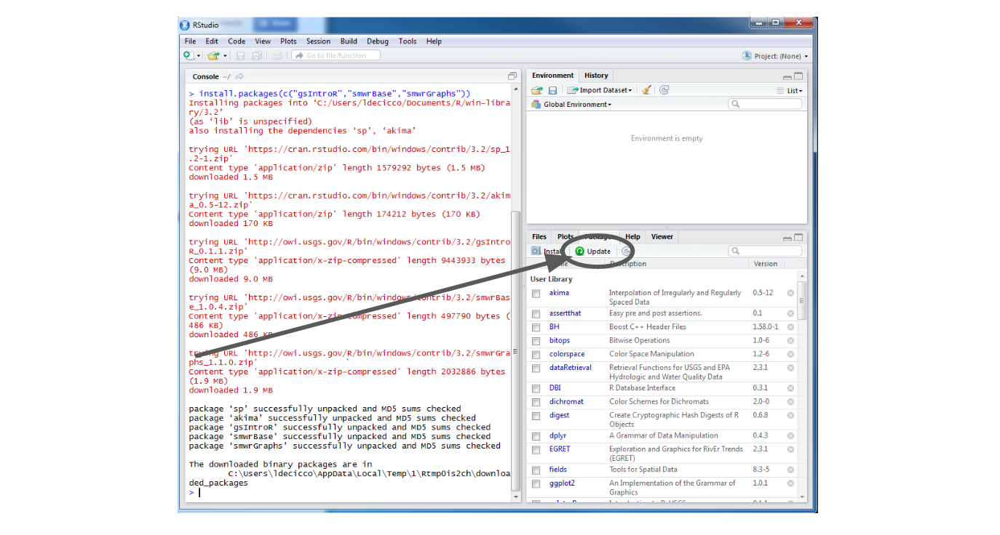

Prior to the start of the workshop everyone will need to have had the software installed and tested. Below are the instructions for installing R and RStudio. If you do not have install access to your computer (often called "PR access"), you will need to contact your IT representative to have them install it. You can give them a link to this page for instructions.sdkjflsd

Install R and RStudio
=====================

These instructions are for Windows install. Download and install R for Mac [here](https://cran.r-project.org/bin/macosx/). If you have trouble installing R on a Mac or Linux machine, please contact us directly at <gs-w_r_admin@usgs.gov>.

Download and install R
----------------------

Go to [CRAN and download](http://cran.rstudio.com/bin/windows/base/) the R installer for Windows. Once the installer downloads, Right-click on it and select "Run as administrator".

Type in your PR credentials and click yes (or have your IT rep install with Admin privileges). 

You can click next through the standard dialogs and accept most defaults. But at the destination screen, please verify that it is installing it to C:Files(version number may vary) 

At the "Select Components" screen, you can accept the default and install both 32-bit and 64-bit versions. 

At this screen, uncheck 'Create a desktop icon' because non-admin users in Windows will be unable to delete it. 

Download and install RStudio
----------------------------

[Download RStudio Desktop](http://www.rstudio.com/products/rstudio/download/)

Double-click the installer. It will ask for your administrator credentials to install (you might need to have your IT rep install again). Accept all the default options for the RStudio install. 

Check Install
=============

Open RStudio
------------

Once installed, RStudio should be accessible from the start menu. Start up RStudio. Once running it should look something like:


Find "Console" window
---------------------

By default the console window will be on the left side of RStudio. Find that window. It will looking something like:


Copy and paste the code
-----------------------

Click in the window and paste in the code from below:

``` r
version$version.string
```

Verify your installed R version
-------------------------------

Ideally you should be running the latest stable release (3.3.X as of July 2016, where X can be any number), although 3.2.X is also ok. If you have an older version, please install the newest version using the instructions above.

Here is what my R version looks like.

    ## [1] "R version 3.2.4 Revised (2016-03-16 r70336)"

Add packages and GRAN
=====================

Install general packages
------------------------

Install packages available for all R users from [CRAN](https://cran.r-project.org/) by pasting the following code and hitting `ENTER`.

``` r
install.packages(c("dplyr","dataRetrieval","ggplot2","tidyr","RColorBrewer","EGRET", "rmarkdown", "geoknife"))
```

If you see


That's OK! There’s a dialog box hiding behind RStudio asking if you want to create a personal folder in your Documents folder. Click *Yes*. It will look something like this when done:


Add GRAN as a default repository
--------------------------------

Modifying the .Rprofile file will tell your R environment to always look in the GRAN repository when installing packages and updating packages. This is the preferred method because of the ability to automatically get GRAN updates. Paste the following code into the Rstudio console to update your .Rprofile:

``` r
rprofile_path = file.path(Sys.getenv("HOME"), ".Rprofile")
write('\noptions(repos=c(getOption(\'repos\'),
    CRAN=\'https://cloud.r-project.org\',
    USGS=\'https://owi.usgs.gov/R\'))\n',
      rprofile_path, 
      append =  TRUE)

cat('Your Rprofile has been updated to include GRAN.
    Please restart R for changes to take effect.')
```

Restart RStudio (close and open). Now, you'll automatically have access to USGS packages and updates.

Package best practices
----------------------

Now that you have installed R and some basic packages, you should get in a good habit of updating them regularly in case the authors fix bugs or add new features. It's best to do this on a weekly basis so that your code is never outdated. To update, click the icon in your packages tab. You can update them all at once or individually.



Optional: Install Rtools
========================

Rtools is used in package development, which is an advanced skill, but one which you might be doing as you become more experienced. It would be handy to have Rtools installed. You will need to install this using admin privileges. Install from [here](https://cran.r-project.org/bin/windows/Rtools/).
