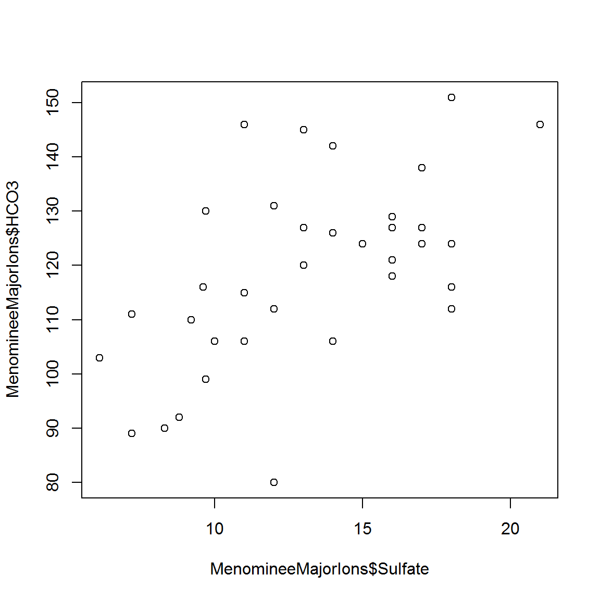
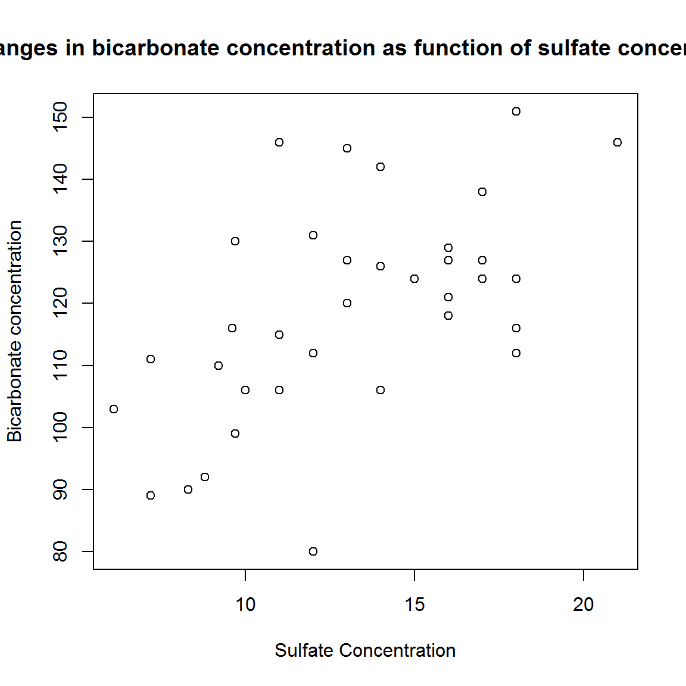
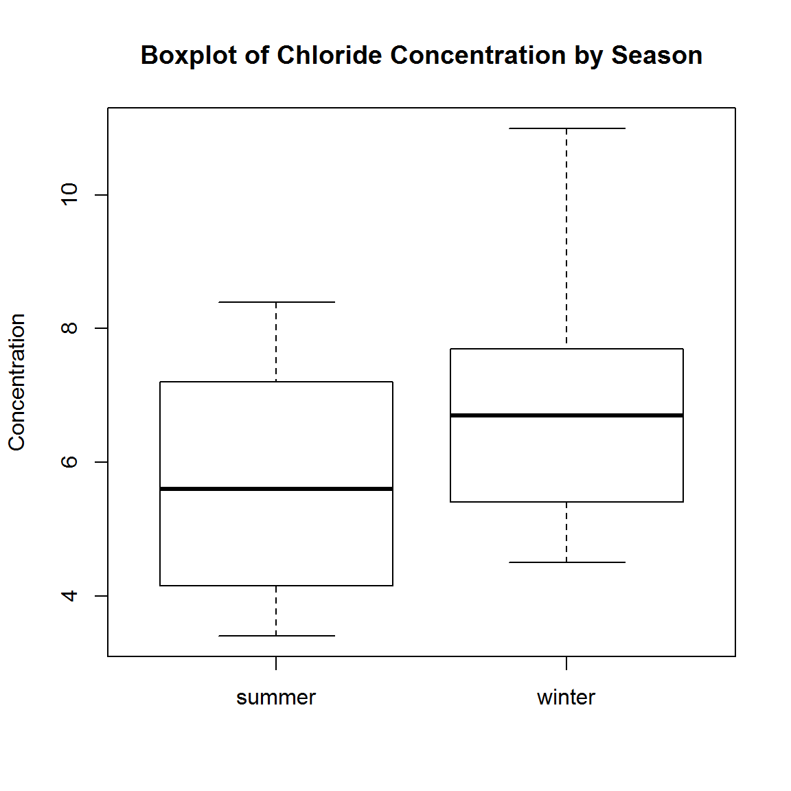
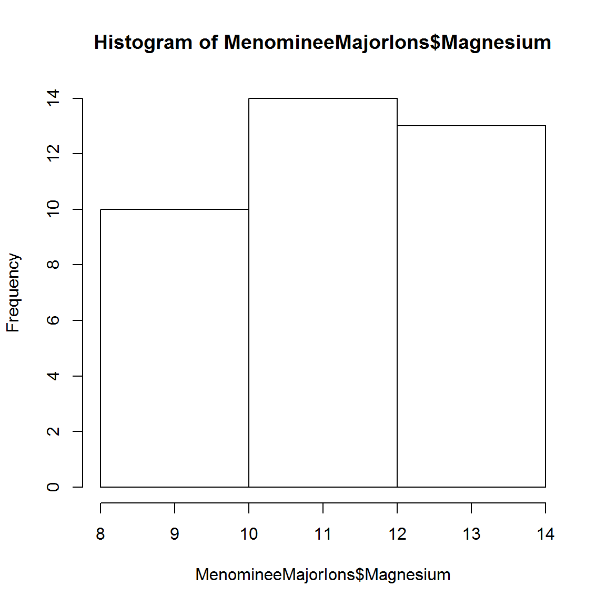
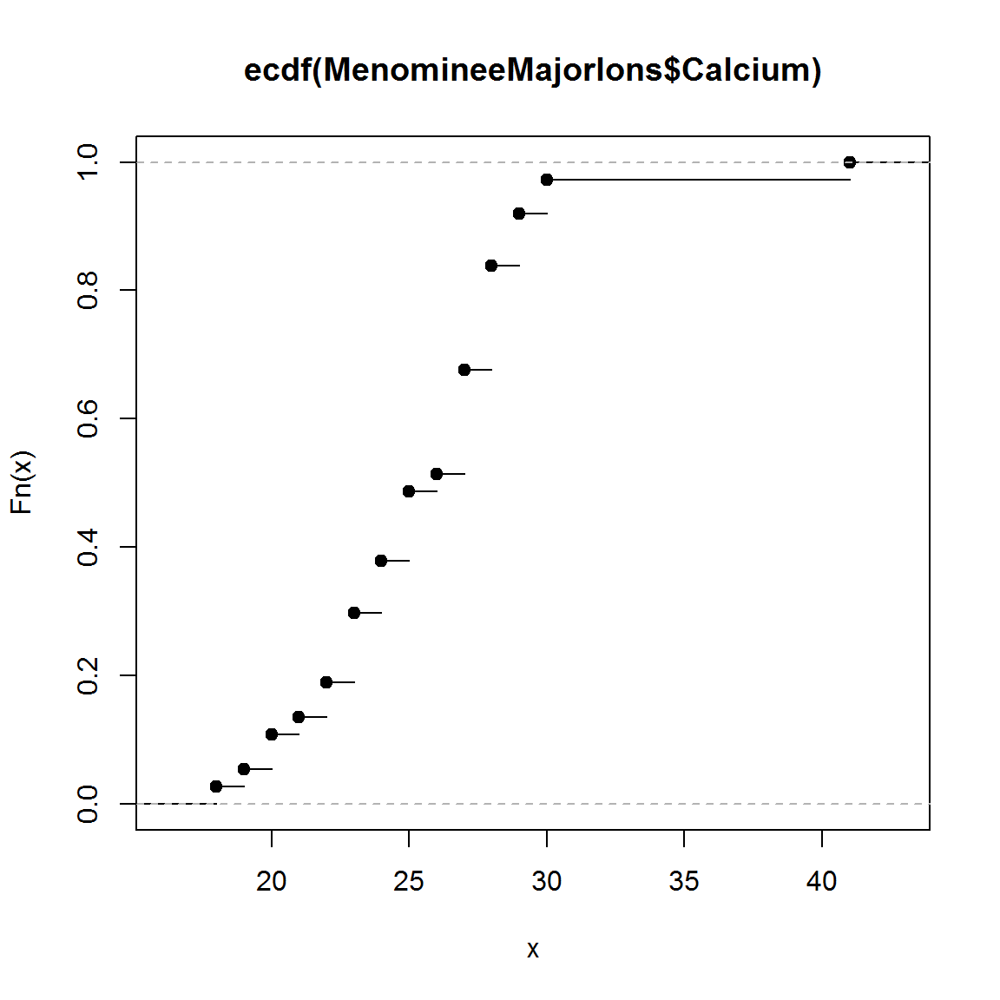

Our next three lessons (Explore, Analyze, and Visualize) don't actually split neatly into groups. That being said, I will try my best, but there will be overlap. For this lesson we are going to focus on some of the first things you do when you start to explore a dataset including basic summary statistics and simple visualizations with base R.

Remember that we are using the NWIS dataset for all of these lessons. If you successfully completed the [Clean](/intro-curriculum/clean) lesson, then you should have the cleaned up version of the data frame. If you did not complete the Clean lesson (or are starting in a new R session), just load in the cleaned csv by downloading it from [here](/intro-curriculum/data), saving it in a folder called "data", and using `read.csv` (see below).

``` r
intro_df <- read.csv("data/course_NWISdata_cleaned.csv", stringsAsFactors = FALSE, 
                     colClasses = c("character", rep(NA, 6)))
```

Quick Links to Exercises and R code
-----------------------------------

-   [Exercise 1](#exercise-1): Exploring data with basic summary statistics
-   [Exercise 2](#exercise-2): Using base R graphics for exploratory data analysis

Lesson Goals
------------

-   Be able to calculate a variety of summary statistics
-   Continue building familiarity with `dplyr` and base R for summarizing groups
-   Create a variety of simple exploratory plots

Summary Statistics
------------------

There are a number of ways to get at the basic summaries of a data frame in R. The easiest is to use `summary()` which for data frames will return a summary of each column. For numeric columns it gives quantiles, median, etc. and for factor a frequency of the terms. This was briefly introduced in the "Get" lesson, but let's use it again.

``` r
summary(intro_df)
```

    ##    site_no            dateTime              Flow        
    ##  Length:3000        Length:3000        Min.   :   0.65  
    ##  Class :character   Class :character   1st Qu.:   5.70  
    ##  Mode  :character   Mode  :character   Median :  12.00  
    ##                                        Mean   : 302.00  
    ##                                        3rd Qu.:  22.00  
    ##                                        Max.   :7340.00  
    ##                                        NA's   :90       
    ##    Flow_cd              Wtemp             pH              DO        
    ##  Length:3000        Min.   :12.90   Min.   :6.200   Min.   : 3.200  
    ##  Class :character   1st Qu.:17.80   1st Qu.:7.000   1st Qu.: 7.100  
    ##  Mode  :character   Median :20.70   Median :7.100   Median : 7.900  
    ##                     Mean   :20.29   Mean   :7.136   Mean   : 7.823  
    ##                     3rd Qu.:22.60   3rd Qu.:7.300   3rd Qu.: 8.600  
    ##                     Max.   :27.70   Max.   :9.100   Max.   :12.700  
    ##                     NA's   :90      NA's   :90      NA's   :90      
    ##   pH_det_lim       
    ##  Length:3000       
    ##  Class :character  
    ##  Mode  :character  
    ##                    
    ##                    
    ##                    
    ## 

If you want to look at the range, use `range()`, but it is looking for a numeric vector as input. Also, don't forget to tell it to ignore NAs!

``` r
range(intro_df$Flow, na.rm=TRUE)
```

    ## [1]    0.65 7340.00

The interquartile range can be easily grabbed with `IQR()`, again a numeric vector is the input.

``` r
IQR(intro_df$Wtemp, na.rm=TRUE)
```

    ## [1] 4.8

Lastly, quantiles, at specific points, can be returned with, well, `quantile()`.

``` r
quantile(intro_df$pH, na.rm=TRUE)
```

    ##   0%  25%  50%  75% 100% 
    ##  6.2  7.0  7.1  7.3  9.1

I use quantile quite a bit, as it provides a bit more flexibility because you can specify the probabilities you want to return.

``` r
quantile(intro_df$pH, probs=c(0.025, 0.975), na.rm=TRUE)
```

    ##  2.5% 97.5% 
    ##   6.6   7.8

Exercise 1
----------

Next, we're going to explore `intro_df` using base R statistical functions. We want a data frame that has mean, median, and IQR for each of the measured values in this data set. We will use `dplyr` to help make this easier.

1.  Summarize DO and pH by the summary statistics mean, median, and interquartile range. Hint: don't forget the argument `na.rm=TRUE` for the stats functions!

2.  Add a step to calculate the 90th percentile for pH and DO. Hint: this requires an additional argument to the `quantile` function.

*To get summary statistics for each variable, use the dplyr `summarize_at` function. The arguments for this function can be pretty tricky, so try to follow the examples in the help file. See `?summarize_at`*

Basic Visualization
-------------------

Exploratory data analysis tends to be a little bit about stats and a lot about visualization. Later we are going to go into more detail on advanced plotting with both base R and `ggplot2`, but for now we will look at some of the simple, yet very useful, plots that come with base R. I find these to be great ways to quickly explore data.

The workhorse function for plotting data in R is `plot()`. With this one command you can create almost any plot you can conceive of, but for this workshop we are just going to look at the very basics of the function. The most common way to use `plot()` is for scatterplots.

``` r
plot(intro_df$Wtemp, intro_df$DO)
```



Hey, a plot! Not bad. Let's customize a bit because those axis labels aren't terribly useful and we need a title. For that we can use the `main`, `xlab`, and `ylab` arguments.

``` r
plot(intro_df$Wtemp, intro_df$DO,
     main="Changes in D.O. concentration as function of water temperature",
     xlab="Water temperature, deg C", ylab="Dissolved oxygen concentration, mg/L")
```



Let's say we want to look at more than just one relationship at a time with a pairs plot. Again, `plot()` is our friend. If you pass a data frame to `plot()` instead of an x and y vector it will plot all possible pairs. Be careful though, as too many columns will produce an unintelligble plot.

``` r
#get a data frame with only the measured values
library(dplyr)
intro_df_data <- select(intro_df, -site_no, -dateTime, -Flow_cd, -pH_det_lim)
plot(intro_df_data)
```


The plots look a bit strange - we'd expect to see a stronger relationship between water temperature and dissolved oxygen. Let's explore the data to figure out why. Using `head(intro_df)`, I immediately notice that the site numbers are different. That is already a good explanation for why some of these plots are not turning out as we'd expect. Let's try to do a pairs plot for a single site.

``` r
#get a data frame with only the first site values
sites <- unique(intro_df$site_no)
intro_df_site1 <- filter(intro_df, site_no == sites[1])

#now keep only measured values
intro_df_site1_data <- select(intro_df_site1, -site_no, -dateTime, -Flow_cd, -pH_det_lim)

#create the pairs plot
plot(intro_df_site1_data)
```


Ah! Now that water temperature and DO plot makes a bit more sense.

Let's move on to boxplots, histograms, and cumulative distribution functions.

Two great ways to use boxplots are straight up and then by groups in a factor. For this we will use `boxplot()` and in this case it is looking for a vector as input.

``` r
boxplot(intro_df$DO, main="Boxplot of D.O. Concentration", ylab="Concentration")
```


As plots go, well, um, not great. Let's try it with a bit more info and create a boxplot for each of the groups. Note the use of an R formula. In R, a formula takes the form of `y ~ x`. The tilde is used in place of the equals sign, the dependent variable is on the left, and the independent variable\[s\] are on the right. In boxplots, `y` is the numeric data variable, and `x` is the grouping variable (usually a factor).

``` r
boxplot(intro_df$DO ~ intro_df$site_no, 
        main="Boxplot of D.O. Concentration by Site", ylab="Concentration")
```



Lastly, let's look at two other ways to plot our distributions. First, histograms.

``` r
hist(intro_df$pH)
```


``` r
hist(intro_df$pH, breaks=4)
```



And finally, cumulative distribution functions. Since CDF's are actually a function of the distribution we need to get that function first. This requires that we combine `plot()` and `ecdf()`, the empirical CDF function.

``` r
wtemp_ecdf <- ecdf(intro_df$Wtemp)
plot(wtemp_ecdf)
```



Exercise 2
----------

Similar to before let's first just play around with some basic exploratory data visualization using the `intro_df` dataset.

1.  Make a scatter plot relating pH to water temperature.

2.  Create a discharge histogram. Explore different values for the argument `breaks`.

3.  Create a boxplot that compares flows by flow approval codes. If it is difficult to interpret the boxplot, try logging the flow. Are higher flows in this dataset more error prone (`Flow_Cd='X'`)?
