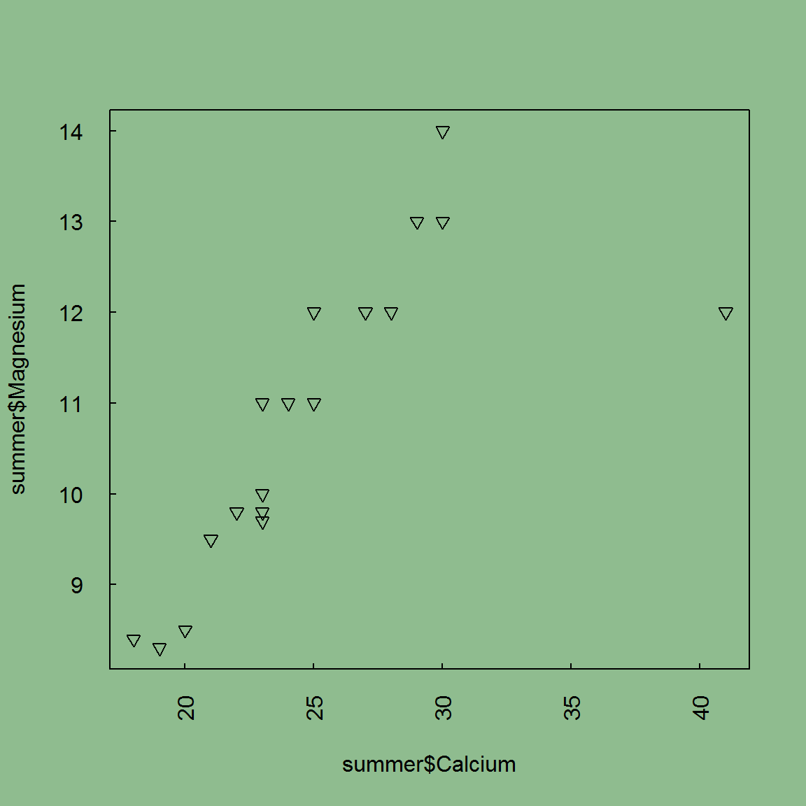
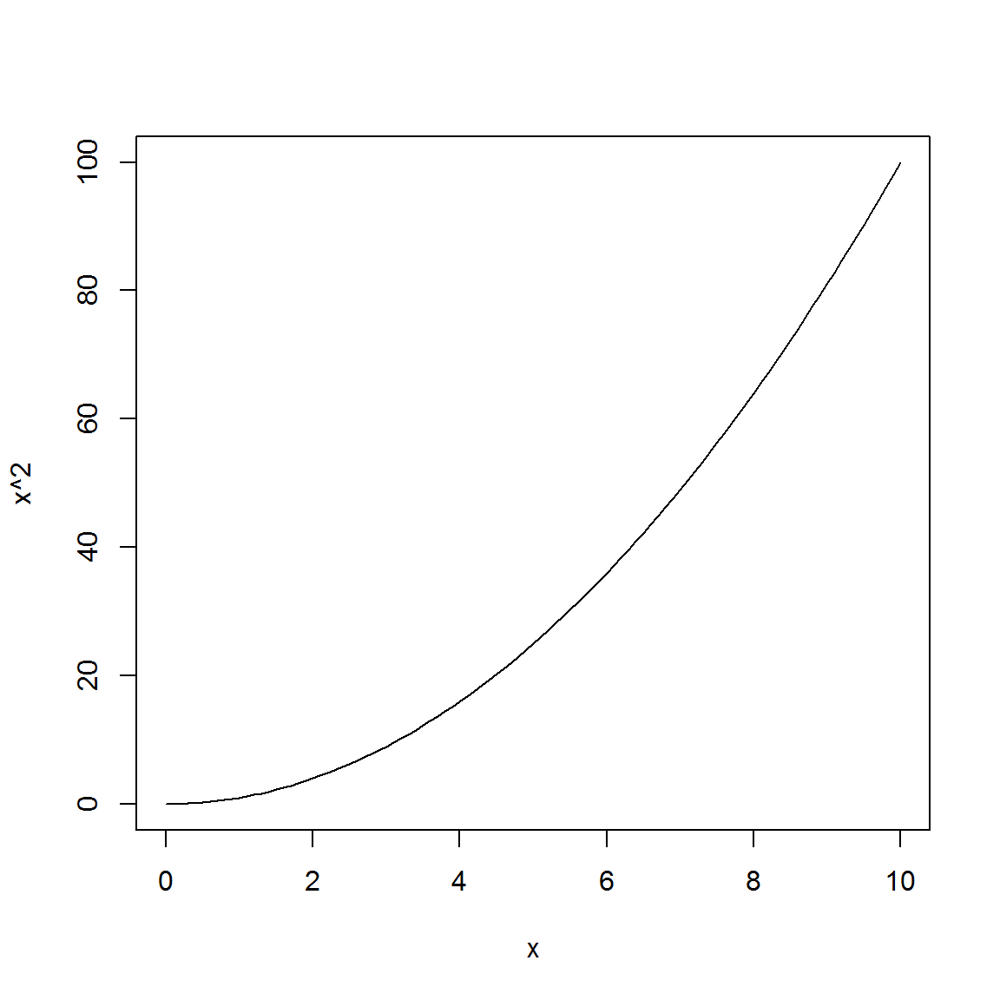
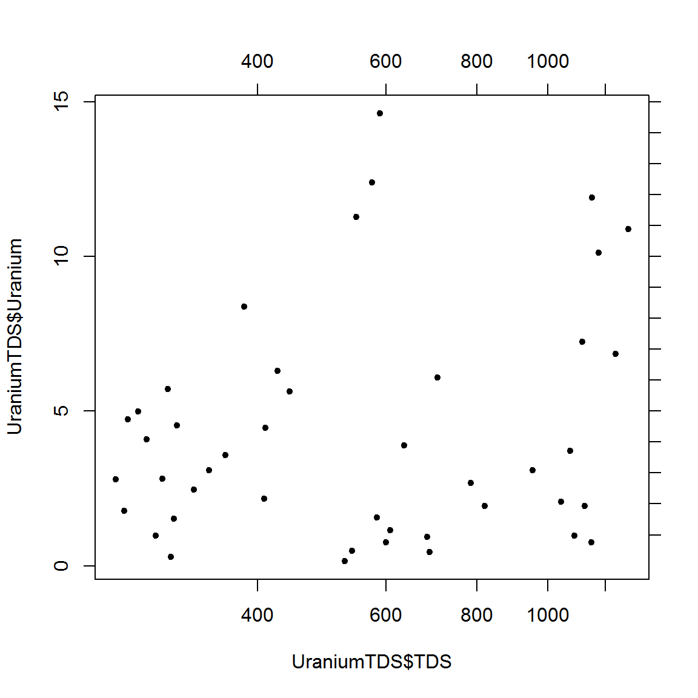

Earlier, there was an introduction to simple plots using the base R features. This section will expand on base R plotting, and highlight its more advanced functions.

Remember that we are using the NWIS dataset for all of these lessons. If you successfully completed the [Clean](/intro-curriculum/clean) lesson, then you should have the cleaned up version of the data frame. If you did not complete the Clean lesson (or are starting in a new R session), just load in the cleaned csv by downloading it from [here](/intro-curriculum/data), saving it in a folder called "data", and using `read.csv` (see below).

``` r
intro_df <- read.csv("data/course_NWISdata_cleaned.csv", stringsAsFactors = FALSE, 
                     colClasses = c("character", rep(NA, 6)))
```

Quick Links to Exercises and R code
-----------------------------------

-   [Exercise 1](#exercise-1): Create plots using a number of styles and graphical parameters.
-   [Exercise 2](#exercise-2): Save an image with multiple plots using secondary axes and log scales.

Lesson Goals
------------

-   Be able to add styles to the plot (colors, linetypes, par arguments, etc)
-   Become familar with additional plotting features (symbols, legends, multiple axes)
-   Create multiple plots in one graphic device
-   Output plots to files

### Plot Styles

So far we have learned to plot data using scatter plots, boxplots, and histograms for exploratory purposes. But what if you wanted to present this data to others? Usually, that would require some work on its style, and base R plotting has many features for this.

First, let's start with two sets of random data and plot them using different colors and point types.

-   `pch` is a number that corresponds to a point type.
-   `col` can be a character string or hexadecimal color (\#RRGGBB)
-   you can use the function `colors()` to get a list of R colors

``` r
#Create two data frames using dplyr (estimated & erroneous flows)
library(dplyr)
intro_df_est <- filter(intro_df, Flow_cd == "E")
intro_df_est_QpH <- select(intro_df_est, Flow, DO)
intro_df_err <-filter(intro_df, Flow_cd == "X") 
intro_df_err_QpH <- select(intro_df_err, Flow, DO)

#Now, plot estimated and erroneous points in different colors
plot(intro_df_err_QpH$Flow, intro_df_err_QpH$DO, pch=16, col='#FF5034')
points(intro_df_est_QpH$Flow, intro_df_est_QpH$DO, pch=16, col='skyblue')
```


Similarly, you can change linetypes (`lty`), linewidths (`lwd`), and point size (`cex`). These all refer to graphical parameters and there are many more. Use `?par` to read about the others.

Graphical parameters also apply to the overall graph. For instance, `las` is used to give the orientation of the axes labels - parallel or perpendicular to the axis, always horizontal, or always vertical. Plot margins can also be set using `par` arguments.

-   use `las` to change the axis labels orientation
-   `tck` changes the tick length (negative is outside of the plot region)
-   `bg` can change the entire graphics device background color

``` r
#save par arguments before changing them
default_par <- par()

#change par
par(las=2, tck=0.01, bg="darkseagreen")
plot(intro_df_err_QpH$Flow, intro_df_err_QpH$DO, pch=6)
```



Make sure to reset par if you want to go back to the original plot style. You can do this by turning off the current graphics device, `dev.off()`, or you can use the `default_par` object created previously, `par(default_par)`.

### Legends

Legends are an obvious necessity for publishing plots built in R. Adding legends is a straightforward process: use the `legend()` function and include vectors of the legend names (`legend`), colors, point/line types, and also the location of the legend (`x`). Including a title is optional. Additional arguments used to customize legends can be found in the help file (`?legend`). Below, is a simple example:

``` r
#use the same plot and add a legend to illustrate color and point type
plot(intro_df_err_QpH$Flow, intro_df_err_QpH$DO, pch=16, col='#FF5034')
points(intro_df_est_QpH$Flow, intro_df_est_QpH$DO, pch=16, col='skyblue')

#add a legend
legend(x="topright", legend=c("Erroneous flows", "Estimated flows"),
       pch=16, col=c('#FF5034', 'skyblue'), title="Legend")
```


### Additional Plotting Features

R base plotting offers features other than points and lines, such as symbols, rectangles, polygons, and curves.

``` r
#plot formulas using curve()
curve(x^2, from=0, to=10)
```



``` r
curve(sin(x), from=-pi, to=pi)
```


``` r
#plot rectangles or polygons
plot(1:15, c(1:7, 9.5, 9:15), type='l')
rect(xleft=6, xright=10, ybottom=5, ytop=11, density=5, col="orange")
polygon(x=c(2,3,4), y=c(2,6,2), col="lightgreen", border=NA)
```


Exercise 1
----------

1.  Create two different data frames from `intro_df` with dissolved oxygen and water temperature data for two sites.

2.  Using the base R plotting features just discussed, plot a dissolved oxygen vs water temperature for two different sites. Show the different sites in different colors, linetypes, or linewidths. Include a legend.

3.  Challenge: add points to show the maximum dissolved oxygen for each timeseries. Hint: use `arrange()` from dplyr. You might notice that you cannot see your second site's maximum point. This is because the plot is scaled to the first data that was added. We will learn how to adjust axes in the next section.

### Axes

You can also customize your plot axes using the `axis()` function and specifying which axis by using the `side=` argument. Add ticks at specific values, and add second x and y axes (side=3 or side=4). To make a log-scale axis, use the argument `log=` and specify the x or y axis.

``` r
plot(intro_df$Flow, intro_df$Wtemp, pch=20)
#add a second y-axis
axis(side=4)
```


``` r
#now log the x axis
plot(intro_df$Flow, intro_df$Wtemp,  pch=20, log='x')
#format the second y-axis to have tick marks at every concentration (not just every 5) & no labels
axis(side=4, at=1:20, labels=FALSE)
#add a second x-axis
axis(side=3) #this axis is also logged
```



### Multiple Plots in One Graphics Device

It is often useful to have multiple plots shown in one image. There are a few ways to accomplish this: par arguments mfcol or mfrow, `layout`, or `split.screen`. We are only going to discuss `layout`.

To use layout, you must first create a matrix specifying the location of each plot. For instance, if you want plot 1 above the second plot, you would set up this matrix: `matrix(c(1,2), 2, 1)`. If you wanted a gap in between your two plots, you could say "0", meaning no plot will be in that location: `matrix(c(1,0,2), 3, 1)`. Then you simply use the function `layout()` with your matrix as the function argument. When you are done plotting with `layout`, make sure to use `dev.off()` in order to reset the plotting region. Otherwise, any subsequent plots will use your defined layout.

``` r
layout_matrix <- matrix(c(1:4), nrow=2, ncol=2, byrow=TRUE)
layout(layout_matrix)

#four boxplots:
plot1 <- boxplot(intro_df$Flow ~ intro_df$site_no, ylab="Discharge, cfs", main="Discharge")
plot2 <- boxplot(intro_df$Wtemp ~ intro_df$site_no, ylab="Temperature, deg C", main="Water Temp")
plot3 <- boxplot(intro_df$pH ~ intro_df$site_no, ylab="pH", main="pH")
plot4 <- boxplot(intro_df$DO ~ intro_df$site_no, ylab="D.O. Concentration, mg/L", main="Dissolved Oxygen")
```


``` r
dev.off()
```

    ## null device 
    ##           1

### Saving Plots

It is very simple to save your plots as images. In RStudio's "Plots" window, you can select the "Export" drop down and say "Save as Image" or "Save as PDF". Alternatively, you can use the following functions: `png()`, `jpeg()`, `pdf()`, `svg()`, and the list goes on. To use, call `png()`, etc. to open a plotting canvas (i.e., a "graphics device"), make your plot on that canvas, then call `dev.off()` to close and save the canvas.

``` r
png("do_vs_wtemp.png", width=5, height=6, res=300, units="in") # see ?png
plot(intro_df$Wtemp, intro_df$DO)
dev.off()
```

The default for `dev.off()` is to turn off the most current device, but you can have several devices open, and you can specify which device to close with the `which` argument.

Exercise 2
----------

Using data for only one site in `intro_df`, complete the following:

1.  Make a plot of dissolved oxygen vs flow. Make the points red and add secondary x and y axes. Use a log scale for flow (hint: use the argument `log` in your plot call).
2.  Now make a second plot with pH vs flow and color the points blue. Use a log scale for flow.
3.  Using `layout`, place the second plot below the first. Plus, have the top plot span the whole device and leave an empty region next to the lower plot.
4.  Save this image as a png.
5.  If there is time, try and use some of the graphical parameters that was discussed in the first part of this lesson to change the look of the plots!
