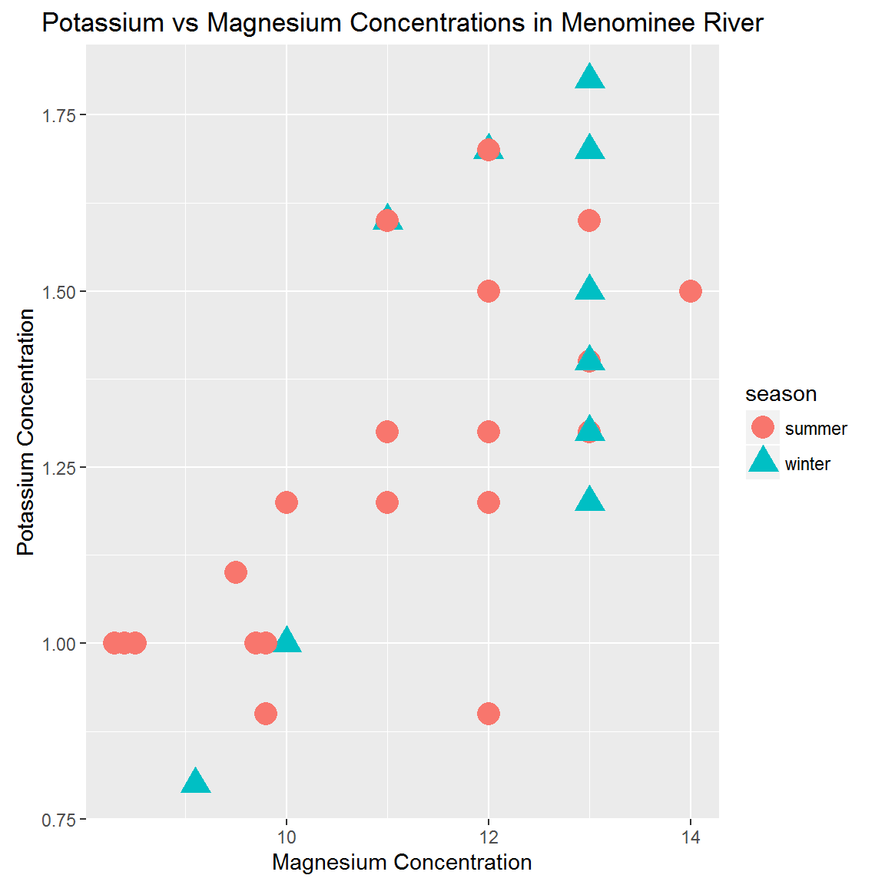
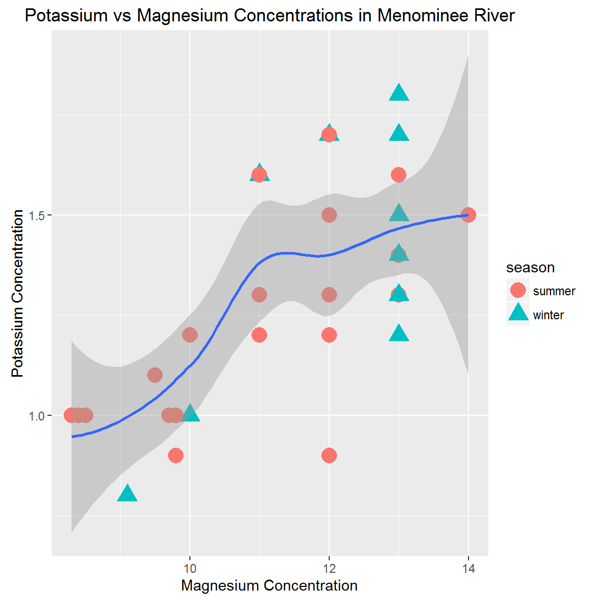
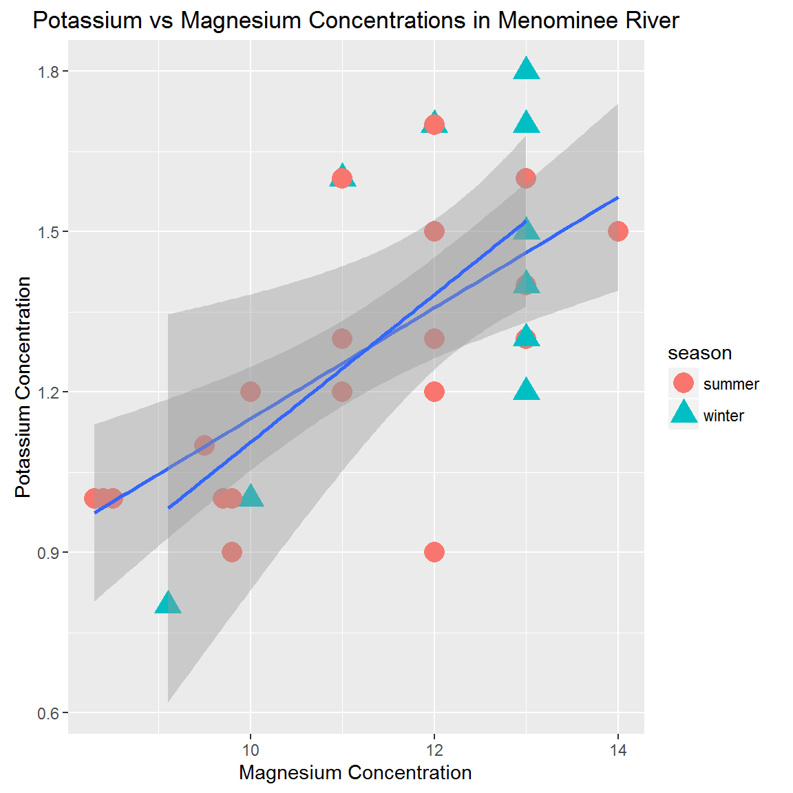
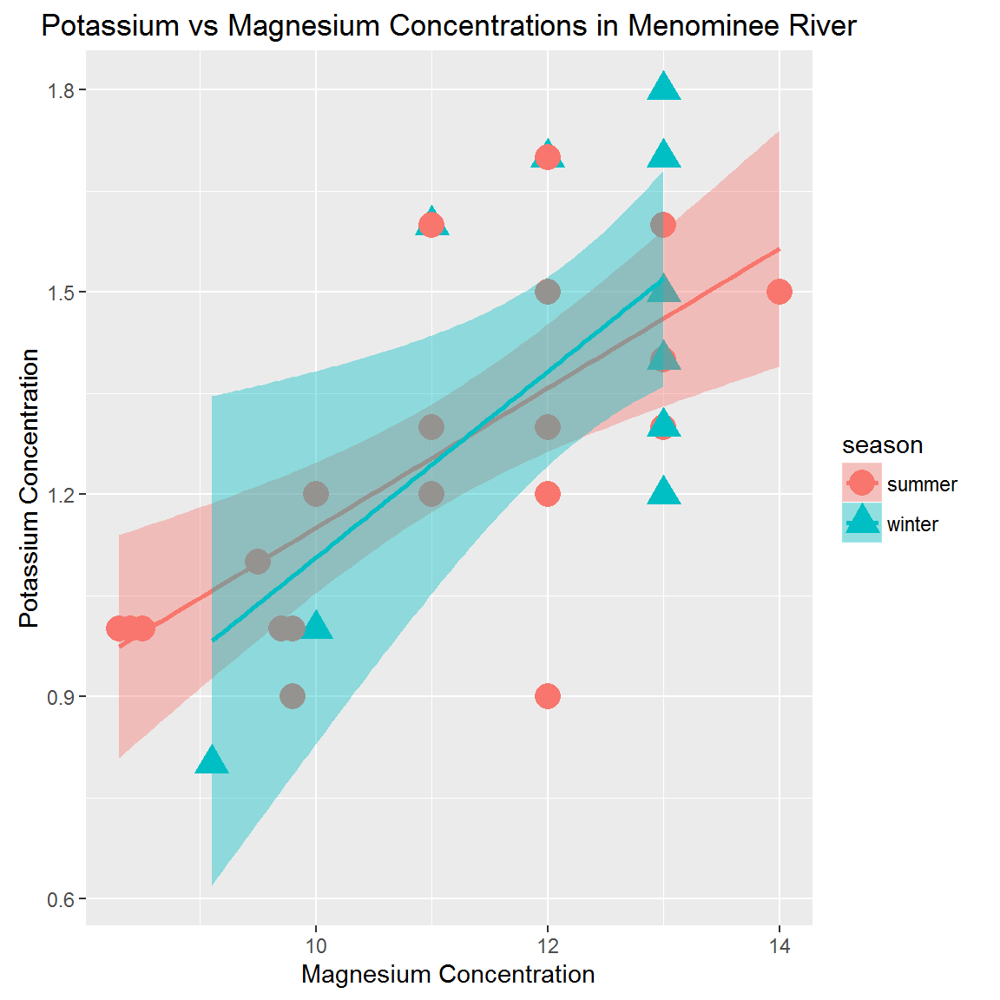
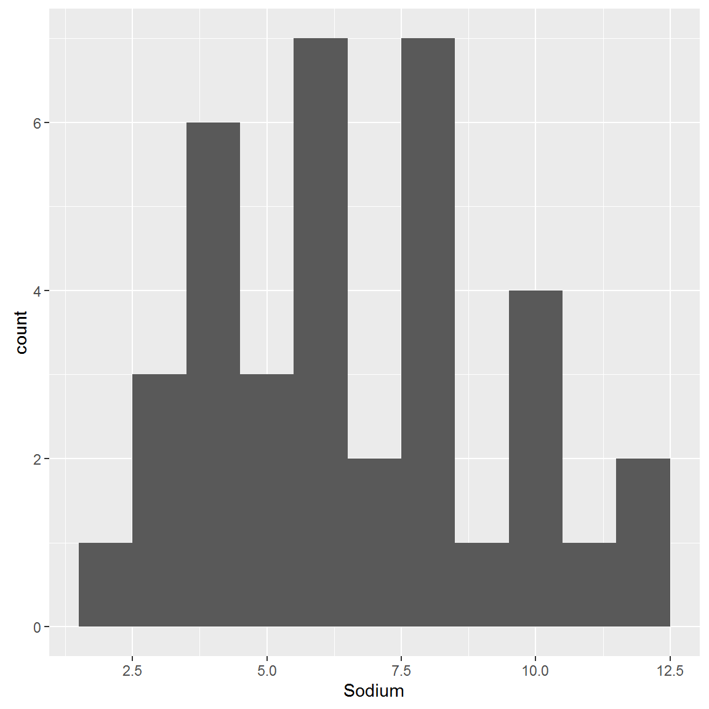
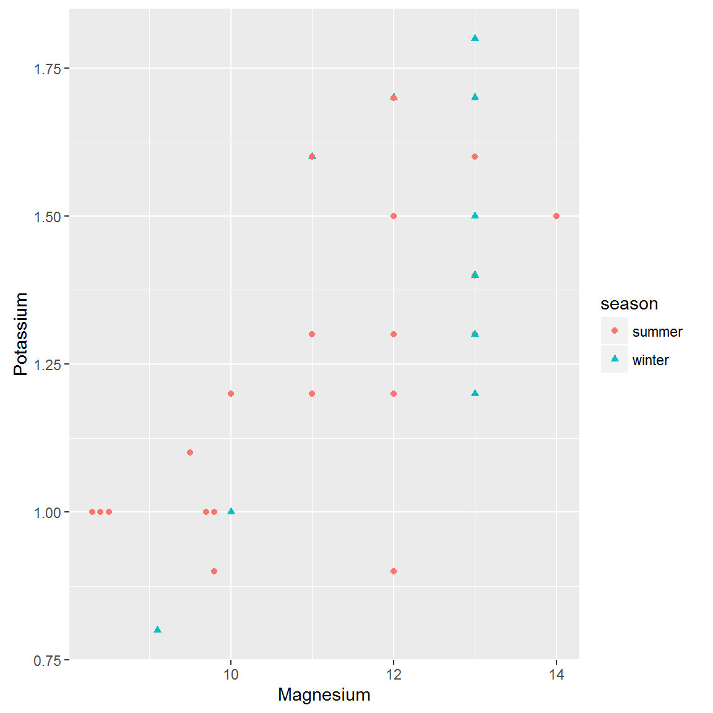
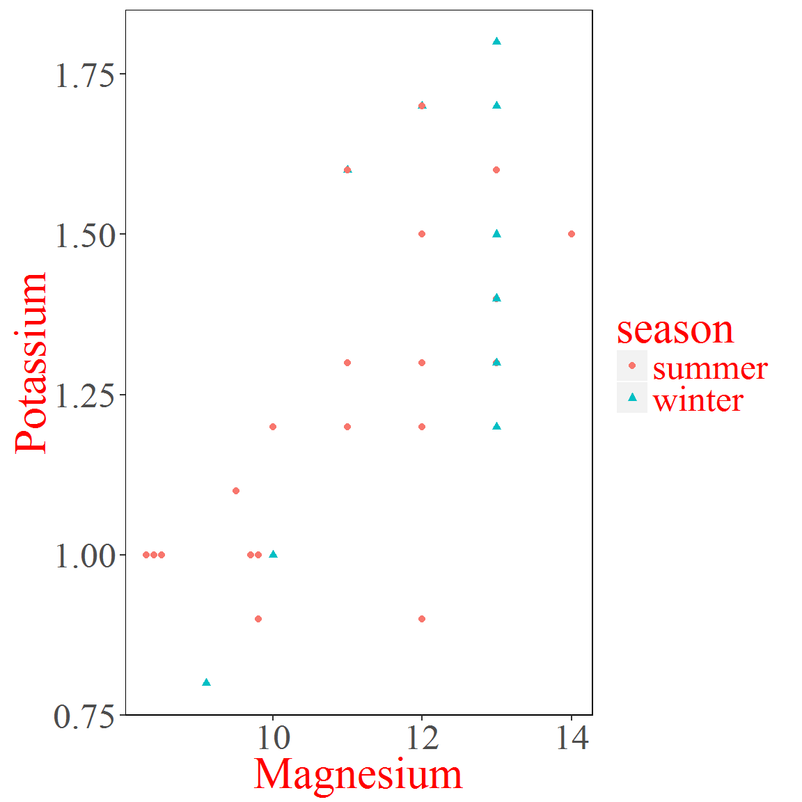
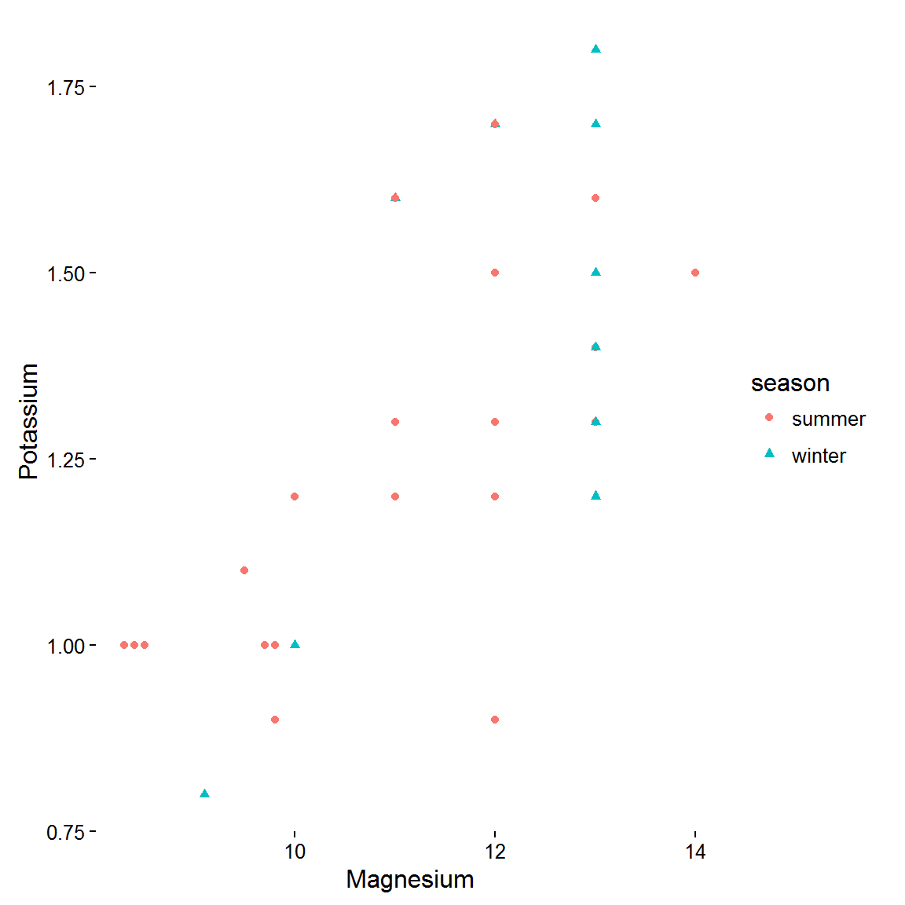
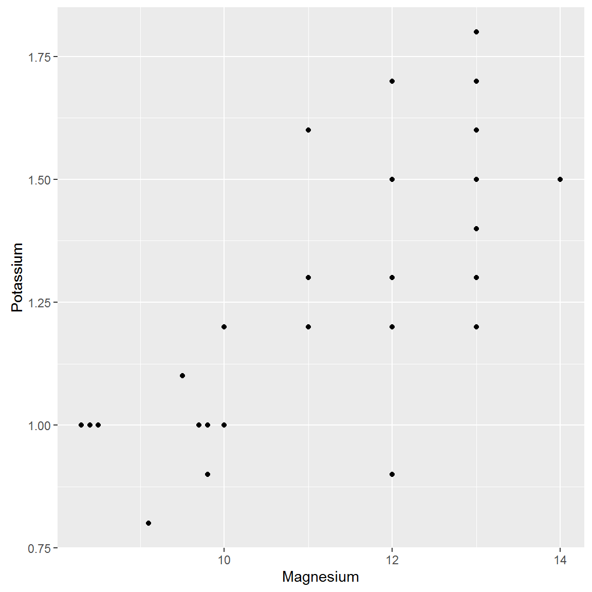
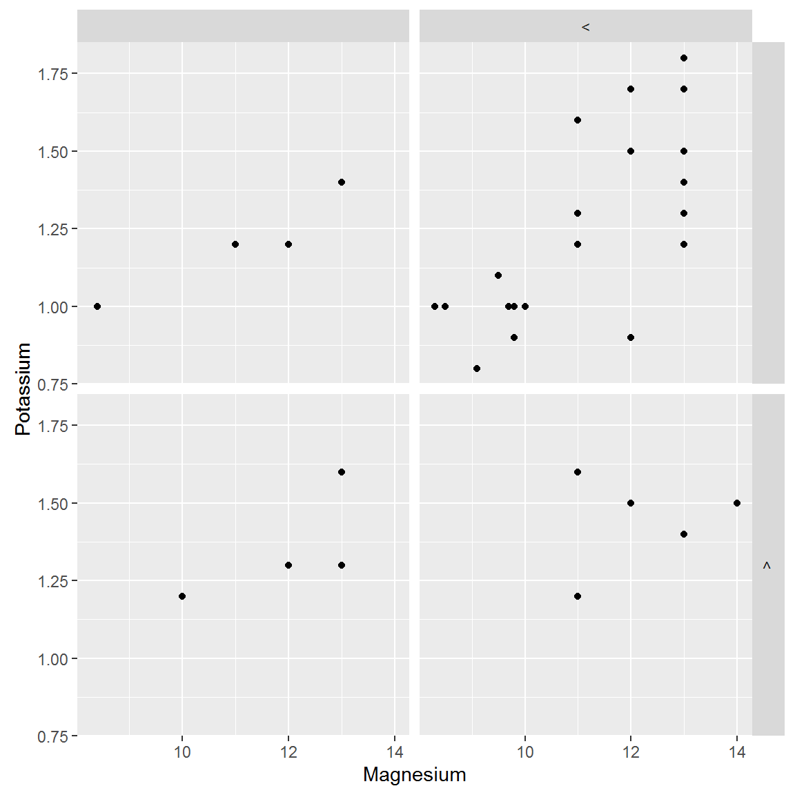

One of the frequently touted strong points of R is data visualization. We saw some of that with our use of base graphics, but those plots were, frankly, a bit pedestrian. More and more users are moving away from base graphics and using the `ggplot2` package. I would even go as far to say that it has almost become the default plotting mechanism in R. This whole lesson we will focus on creating, modifying, and saving plots with `ggplot2`.

Remember to load the NWIS dataset we have been use. If it's no longer loaded, load in the cleaned up version by downloading it from [here](/intro-curriculum/data), and using `read.csv` (remember that we named it `intro_df`, and don't forget `stringsAsFactors=FALSE`, and `colClasses`).

Quick Links to Exercises and R code
-----------------------------------

-   [Exercise 1](#exercise-1): Create a number of styles of plots
-   [Exercise 2](#exercise-2): Build a plot, using custom themes, and save as a jpeg.

Lesson Goals
------------

-   Become familar with some basic plots in `ggplot2`
-   Be able to manipulate the default themes
-   Output plots to files
-   Know where to get some help

ggplot2 Overview
----------------

A lot has been written and discussed about `ggplot2`. In particular see [here](http://ggplot2.org/), [here](http://docs.ggplot2.org/current/) and [here](https://github.com/karthikram/ggplot-lecture). The gist of all this, is that `ggplot2` is an implementation of something known as the "grammar of graphics." This separates the basic components of a graphic into distinct parts (e.g. like the parts of speech in a sentence). You add these parts together and get a figure.

Before we start developing some graphics, we need to do a bit of package maintenance as `ggplot2` is not installed by default.

``` r
# install.packages("ggplot2") # if needed
library(ggplot2)
library(dplyr)
```

First thing we need to do is to create our ggplot object. Everything we do will build off of this object. The bare minimum for this is the data (handily, `ggplot()` is expecting a data frame) and `aes()`, or the aesthetics layers. This is the main place you specify your x and y data values.

``` r
# aes() are the "aesthetics" info.  When you simply add the x and y
# that can seem a bit of a confusing term.  You also use aes() to 
# change color, shape, size etc. of some items
qtemp_gg <- ggplot(data=intro_df, aes(x=Flow_Inst, y=Wtemp_Inst))
qtemp_gg
```


All we did at this point is create a blank slate that contains our data and knows what we want on the x and y axes. We haven't said anything about what type of plot we want to make. That comes next with the use of geometries.

So if we want to simply plot points we can add it to the ggplot object. These are known as the geometries.

A side note on syntax. You will notice that we add new "things" to a ggplot object by adding new functions. In concept this is very similar to the piping we talked about earlier. Essentially it takes the output from the first function as the input to the second. So to add points and create the plot, we would do:

``` r
#Different syntax than you are used to
qtemp_gg + geom_point()
```


``` r
#This too can be saved to an object
qtemp_scatter <- qtemp_gg + geom_point()

#Call it to create the plot
qtemp_scatter
```


Not appreciably better than base, in my opinion. But what if we want to add some stuff...

First a title and some axis labels. These are part of `labs()` (or can be assigned separately with `ggtitle()`, `xlab()`, and `ylab()`).

``` r
qtemp_scatter <- qtemp_scatter +
  labs(title="Water temperature vs Flow",
       x="Discharge, cfs", y="Water temperature, deg C")
# same thing, different commands
qtemp_scatter <- qtemp_scatter +
  ggtitle("Water temperature vs Flow") +
  xlab("Discharge, cfs") + ylab("Water temperature, deg C")
qtemp_scatter
```


Now to add some colors, shapes, etc. to the point. Look at the `geom_point()` documentation for this. Notice that ggplot2 makes the correct legend for us without help!

``` r
qtemp_scatter <- qtemp_scatter +
  geom_point(aes(color=Flow_Inst_cd, shape=site_no), size=2)
qtemp_scatter
```



Much easier than using base, but `ggplot2` really shines when you want to add stats (regression lines, intervals, etc.). Lets add a loess line with 95% confidence intervals

``` r
qtemp_scatter + geom_smooth()
```



Or we could add a simple linear regression line with:

``` r
qtemp_scatter + geom_smooth(method="lm")
```


And if we are interested in the regressions by group we could do it this way.

``` r
qtemp_scatter + geom_smooth(method="lm", aes(group=site_no))
```



Or, if we wanted our regression lines to match the color.

``` r
qtemp_scatter + geom_smooth(method="lm", aes(color=Flow_Inst_cd, fill=Flow_Inst_cd))
```



You'll notice that I had to specify the `aes()` again, but for `geom_smooth()`. We only specified the x and y in the original `ggplot` object, so if want to do something different in the subsequent functions we need to overwrite it for the function in which we want a different mapping (i.e. groups).

In short, some of the initial setup for ggplot is a bit more verbose than base R, but when we want to do some more complex plots it is much easier in `ggplot2`.

Before we get into another exercise, let's look at some of the other geometries.In particular, boxplots, histograms, and bar charts. If you want to see all that you can do, take a look at the list of `ggplot2` [geom functions](http://docs.ggplot2.org/current/index.html).

### Boxplots

A simple boxplot with groups looks like this:

``` r
ggplot(data=intro_df, aes(x=site_no, y=DO_Inst)) + geom_boxplot()
```


### Histograms

Histograms only need a single variable (x).

``` r
ggplot(data=intro_df, aes(x=pH_Inst))+ geom_histogram()
```



### Barplots

Barplots can be done easily but often you want to plot a summary statistic (e.g. mean value) for different groups. This requires setting up the data in the correct format first. We can do that with `dplyr` first, then pass the result to `ggplot()`.

``` r
intro_df_grouped <- group_by(intro_df, site_no)
intro_df_flow_mean <- summarize(intro_df_grouped, mean_flow=mean(Flow_Inst, na.rm=TRUE))
ggplot(intro_df_flow_mean, aes(x=site_no, y=mean_flow)) +
  geom_bar(stat="identity")
```


Exercise 1
----------

Let's now build some plots with `ggplot2`.

1.  Load the `CuyahogaTDS` dataset from the `smwrData` package.
2.  Create a scatter plot of total dissolved solids (`TDS`) response to flow (`Q`).
3.  Create a histogram for total dissolved solids.
4.  Create a boxplot comparing the flow grouped by month.
5.  Challenge: recreate the scatter plot where flow is logged.

Customizing plots with themes
-----------------------------

I am certain there are some opinions (good and bad) about the default look and feel of a `ggplot2` plot. Personally, I think it is an improvement over `base`, but generally not what I want for my plots. The `theme()` function (and related functions), give us the ability to completely customize the plot. A great place to start with this is the [themes vignette](http://docs.ggplot2.org/dev/vignettes/themes.html) within `ggplot2`. We could spend a whole day just on this, so for this class we are going to look at the very basics and then use some of the canned themes.

Let's first recreate our Water temperature versus scatterplot from earlier.

``` r
qtemp_scatter <- ggplot(data=intro_df, aes(x=Flow_Inst, y=Wtemp_Inst)) +
  geom_point(aes(color=Flow_Inst_cd, shape=site_no))
qtemp_scatter
```



Nothing new there. Let's now edit some of this theme by dropping the grey background and the grid, and changing our font.

``` r
qtemp_scatter_base <- qtemp_scatter + 
  theme(panel.background = element_blank(), 
        panel.grid = element_blank(),
        panel.border = element_rect(fill = NA),
        text = element_text(family="serif", color="blue", size=15))
qtemp_scatter_base
```



Still not great, but it shows the basics. You can build on this and edit EVERYTHING in the plot. To get an idea of what you have access to, take a look at the help on `theme()` (e.g. `help("theme")`).

There are a few alterantive themes available by default (use `help("ggtheme")`) that save some time and typing. Let's look at two.

``` r
qtemp_scatter + theme_bw()
```


``` r
qtemp_scatter + theme_classic()
```



Let's build on one of the default themes to create a more polished plot.

``` r
#Now Let's start over, with some new colors and regression lines
qtemp_scatter_polished <- ggplot(data=intro_df, aes(x=Flow_Inst, y=Wtemp_Inst)) +
  geom_point(aes(color=Flow_Inst_cd, shape=site_no)) +
  stat_smooth(method="lm", aes(color=Flow_Inst_cd)) + 
  theme_bw(15, "serif") +
  theme(text=element_text(color="slategray"), panel.grid = element_blank()) +
  labs(title="Relationship between Water temperature and Discharge",
       x="Discharge, cfs", y="Water temp, deg C")

qtemp_scatter_polished 
```


A bit complicated for some of the custom stuff, but that is the price you have to pay to get complete control over the output.

### Saving Plots

Last thing we probably want to do now is to save the plot. Since we have our plot as a `ggplot` object we can use the `ggsave()` function.

``` r
#Save as jpg, with 600dpi, and set width and height (see ?ggsave)
ggsave(plot=qtemp_scatter_polished, file="Fig1.jpg", dpi=600, width=8, height=5)
#Save as PDF
ggsave(plot=qtemp_scatter_polished, file="Fig1.pdf")
```

Exercise 2
----------

Let's create a simple scatter plot and spice it up.

1.  Use the `SaddlePeaks` dataset from `smwrData` and create a scatter plot of flow vs time.
2.  Change up the theme of your plot. This is your plot, so experiment. Experiment with fonts, colors, backgrounds, etc. Remember that all of the things you can change are listed in the help (`help("theme")`). You can also run `names(theme_get())` for a list of arguments allowed in `theme()`. Also the various `element_xxx()` functions will be needed; try `??element_` . Remember that the [online help](http://docs.ggplot2.org/current/) is the best for `ggplot2`.
3.  If you have time, try to edit the colors of your points (hint: revisit `geom_point`). Also, try adding a plot title.
4.  When you get the plot to a point where you are happy, save the plot to a file. Use a file format of your liking.

Cool stuff
----------

In this last section we won't have an exercise, but I did want to show some other things that `ggplot2` can do and show some other functions that people have built on top of `ggplot2` that are pretty cool. Lastly, I provide some links on more reading as well as some nice (and fun) data visualization galleries.

### Other Themes

There are even more amazing themes on the web. See the [ggthemes](https://github.com/jrnold/ggthemes) package for some good ones.

### Facets

Facets allow you to lay out multiple plots in a grid. With a single facet the result is similar to what we already accomplished by coloring/sizing points based on a factor in the dataset, but it separates into different plots and we can easily add an additional factor to organize by column. Looking at some of the examples provided with `facet_grid()` shows us how these can work.

``` r
#Return to Water temp vs Flow scatter plot
qtemp <- ggplot(data=intro_df, aes(x=Flow_Inst, y=Wtemp_Inst)) +
  geom_point() 
qtemp
```



``` r
# Faceting with one variable 
# site_no = row faceting
# . = no column faceting
qtemp + facet_grid(site_no ~ .)
```


``` r
# Faceting with two variables
#site_no = row faceting
#Flow_Inst_cd = column faceting
qtemp + facet_grid(site_no ~ Flow_Inst_cd)
```



Documentation
-------------

### Sources of Help on `ggplot2`

-   [Winston Chang's Cookbook](http://www.cookbook-r.com/Graphs/): Many great step-by-step examples. Good starting point for you own plots
-   [Offical `ggplot2` documentation](http://docs.ggplot2.org/current/): The authoritative source. Also many great examples.

### R Data Viz Examples

-   Cool rCharts examples: [rCharts Gallery](http://rcharts.io/gallery/)
-   ggplot examples: [Google Image Search](http://goo.gl/P0q2Lx)
-   R Data Viz, gone wrong: [Accidental aRt](http://accidental-art.tumblr.com)
