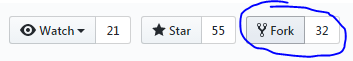
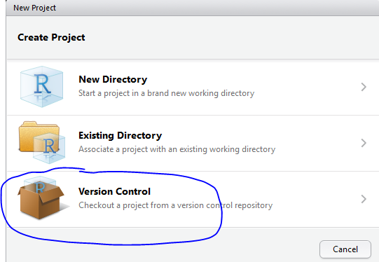
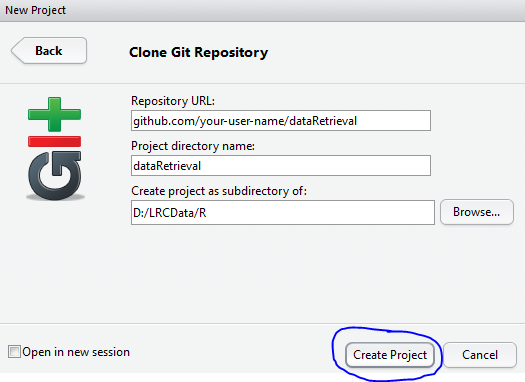
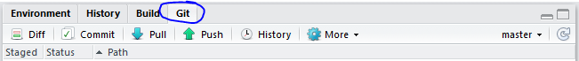
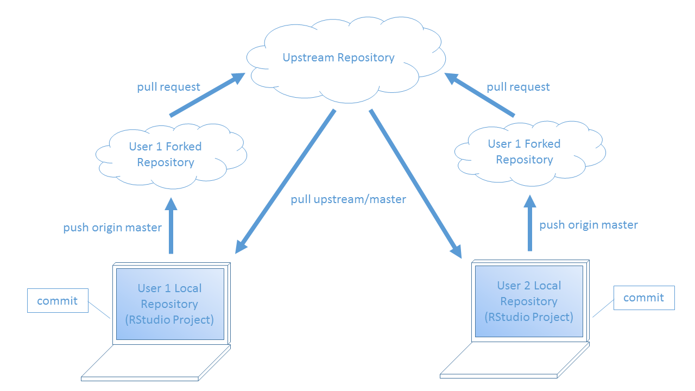

Version control is a tool that allows you to keep track of changes to a number of files. Using version control for package development means that you can easily revert to previous package versions, collaborate with multiple developers, and record reasons for the changes that are made. For this course, we will only discuss the version control language Git and its web interface, GitHub.

Lesson Objectives
-----------------

1.  Define version control and give examples of how it is useful.
2.  Navigate the GitHub interface.
3.  Summarize a typical GitHub-to-R workflow.

Why version control?
--------------------

Version control systems allow you to have organized code repositories by tracking changes. There are many version control systems, but we will only be covering Git in this course. Git can track every change made to a file, annotate the change, and keep record of the change through time. Git maintains a history of the code base and allows you to revert to previous versions if necessary. Git refers to the version control language and commands are typed into the terminal starting with the word `git`.

A web interface called GitHub allows users to visually see their tracked changes and has additional features, such as issues, milestones, review requests, and commenting. With GitHub, changes to code can be associated with bugs and feature requests. GitHub also enables open science practices by sharing what goes on "behind-the-scenes" in the code. In addition, GitHub is a great tool for collaborative work because issues, comments, and peer reviews can be associated with a specific GitHub user account. Each user can edit the code at the same time and handle conflicts appropriately.

In this course, we will be using Git and GitHub in conjunction with RStudio to complete version control workflows.

Setting up Git to work with RStudio
-----------------------------------

?? Git Bash? Should this go in the initial setup page under Getting Started? SSH

Git/GitHub Definitions
----------------------

Here are some terms to be familiar with as we go through our recommended version control workflow.

``` r
Term <- c("repository", "fork", "commit", "pull request", "branch", "upstream", "master")
Definition <- c(
  "a collection of files, aka repo",
  "a user's version of the original repository",
  "saved change(s) to code",
  "a request to merge changes from one repository to another, aka PR",
  "specific instance of your fork; there can be more than one branch on any fork (all will have 'master' which is the main branch)",
  "used to refer to the original repository",
  "used to refer to your forked repository"
)

library(htmlTable)
htmlTable(data.frame(Term, Definition), 
          caption="Table 1. Common Git and GitHub definitions",
          rnames=FALSE, align=c("l","l"), col.rgroup = c("none", "#F7F7F7"), 
          css.cell="padding-bottom: 0.5em; padding-right: 0.5em; padding-top: 0.5em;")
```

<table class="gmisc_table" style="border-collapse: collapse; margin-top: 1em; margin-bottom: 1em;">
<thead>
<tr>
<td colspan="2" style="text-align: left;">
Table 1. Common Git and GitHub definitions
</td>
</tr>
<tr>
<th style="border-bottom: 1px solid grey; border-top: 2px solid grey; text-align: center;">
Term
</th>
<th style="border-bottom: 1px solid grey; border-top: 2px solid grey; text-align: center;">
Definition
</th>
</tr>
</thead>
<tbody>
<tr>
<td style="padding-bottom: 0.5em; padding-right: 0.5em; padding-top: 0.5em; text-align: left;">
repository
</td>
<td style="padding-bottom: 0.5em; padding-right: 0.5em; padding-top: 0.5em; text-align: left;">
a collection of files, aka repo
</td>
</tr>
<tr style="background-color: #f7f7f7;">
<td style="padding-bottom: 0.5em; padding-right: 0.5em; padding-top: 0.5em; background-color: #f7f7f7; text-align: left;">
fork
</td>
<td style="padding-bottom: 0.5em; padding-right: 0.5em; padding-top: 0.5em; background-color: #f7f7f7; text-align: left;">
a user's version of the original repository
</td>
</tr>
<tr>
<td style="padding-bottom: 0.5em; padding-right: 0.5em; padding-top: 0.5em; text-align: left;">
commit
</td>
<td style="padding-bottom: 0.5em; padding-right: 0.5em; padding-top: 0.5em; text-align: left;">
saved change(s) to code
</td>
</tr>
<tr style="background-color: #f7f7f7;">
<td style="padding-bottom: 0.5em; padding-right: 0.5em; padding-top: 0.5em; background-color: #f7f7f7; text-align: left;">
pull request
</td>
<td style="padding-bottom: 0.5em; padding-right: 0.5em; padding-top: 0.5em; background-color: #f7f7f7; text-align: left;">
a request to merge changes from one repository to another, aka PR
</td>
</tr>
<tr>
<td style="padding-bottom: 0.5em; padding-right: 0.5em; padding-top: 0.5em; text-align: left;">
branch
</td>
<td style="padding-bottom: 0.5em; padding-right: 0.5em; padding-top: 0.5em; text-align: left;">
specific instance of your fork; there can be more than one branch on any fork (all will have 'master' which is the main branch)
</td>
</tr>
<tr style="background-color: #f7f7f7;">
<td style="padding-bottom: 0.5em; padding-right: 0.5em; padding-top: 0.5em; background-color: #f7f7f7; text-align: left;">
upstream
</td>
<td style="padding-bottom: 0.5em; padding-right: 0.5em; padding-top: 0.5em; background-color: #f7f7f7; text-align: left;">
used to refer to the original repository
</td>
</tr>
<tr>
<td style="padding-bottom: 0.5em; padding-right: 0.5em; padding-top: 0.5em; border-bottom: 2px solid grey; text-align: left;">
master
</td>
<td style="padding-bottom: 0.5em; padding-right: 0.5em; padding-top: 0.5em; border-bottom: 2px solid grey; text-align: left;">
used to refer to your forked repository
</td>
</tr>
</tbody>
</table>
Our recommended workflow
------------------------

There are many ways to use Git, GitHub, and RStudio in your version control workflow. We will discuss the method USGS-R has predominately used. It is most similar to the "fork-and-branch" workflow (see the [additional resources](#additional-resources) section below). There are three locations of the repository: 1) master on GitHub, 2) forked repository on GitHub, and 3) the user's local repository.

### Initial version control setup for a project

The initial setup requires a master repository on GitHub. To create a new master repo on GitHub, follow [these instructions](https://help.github.com/articles/creating-a-new-repository/). Once there is a master repository, the user looking to contribute to this code base would Fork the repository to their own account.



Next, the user would create the local version of the forked repo from R. When creating a new RStudio project, select Version Control, then select Git, and then paste the URL to the forked repository. It should automatically populate the Project directory name from the URL. Then you can select "Create Project" and it will open a new RStudio project. You should see a new tab in the environment pane that you have not seen before called "Git".








### Workflow for every group of changes you make

Make changes and commit locally Push to remote fork Pull request your fork to master repo on GitHub PR reviewed and merged Close the loop: pull from upstream, merge with local



Handling merge conflicts
------------------------

Branching, gitignore, stashing
------------------------------

Common Git commands
-------------------

git remote -v git remote add upstream <url> git fetch upstream git merge upstream/master git push origin/master git checkout -b <new-branch-name> git branch -d <branch-name> git stash <name> git stash apply <name>

&lt; name="additional-resources"</a> \#\# Other useful resources

Here are links to additional resources about how to use Git, GitHub, and the RStudio interface for Git. We learned a specific Git workflow, "Fork-and-branch", but these resources might use a different workflow. Just keep that in mind as you explore them.

-   [Happy Git and GitHub for the useR by Jenny Bryan](http://happygitwithr.com/)
-   [Using the Fork-and-Branch Git Workflow by Scott Lowe](http://blog.scottlowe.org/2015/01/27/using-fork-branch-git-workflow/)
